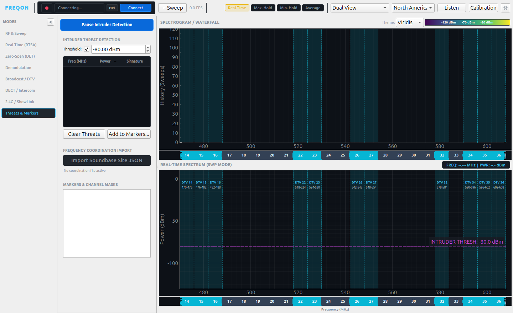

# fReqon - RF Analysis Tool for Harogic Analyzers

**fReqon** is an advanced, high-performance RF Spectrum Analysis, Signal Intelligence, and Live Frequency Monitoring suite built specifically for **Harogic Technologies** Real-Time Spectrum Analyzers (SAN, SAM, SAE series). Designed for mission-critical wireless audio coordination, broadcast engineering, and RF threat intelligence, fReqon delivers real-time DPX acquisition, deep hardware control, continuous sweeping, multi-row folded spectrograms, and automated rogue transmission detection.

---

## Visual Tour

### Threat Detection & Intruder Alert (UHF Band with DTV Channel Masks)

*Figure 1: Threats & Markers mode active across the 470–608 MHz UHF broadcast band. Digital TV channel allocations (Ch 14–16, 22–23, 26–27, 32, 34–36) are shaded with 6 MHz ATSC masks. The draggable magenta Intruder Threshold line (-80.0 dBm) monitors clear whitespace for unauthorized carriers.*

---

### Multi-Row Folded Spectrogram (Waterfall)

*Figure 2: 4-Row Folded Spectrogram view segmenting the UHF band across stacked rows. This architecture multiplies horizontal resolution fourfold, ensuring narrowband wireless microphone signals and fast transients remain crisp and actionable without horizontal compression.*

---

## Deep Dive: Threat Detection & Intruder Alert

During live events, theatrical productions, broadcast shoots, and high-security venues, unexpected or unauthorized transmissions can degrade wireless microphone links, in-ear monitors (IEMs), and intercom systems. The **Threat Detection & Intruder Alert** engine in fReqon provides continuous, automated RF defense.

### 1. Interactive Visual Threshold Line
- **Plot-Coupled Infinite Line**: A high-visibility dashed magenta threshold line is superimposed directly across the spectrum display (`INTRUDER THRESH: -xx.x dBm`).
- **Direct Drag & Drop**: Operators can grab and drag the line vertically with the mouse to adjust the trip point on the fly, or adjust it via the dedicated numeric spinbox in the control panel.
- **Visual Contrast**: Hovering over the threshold line highlights it with dynamic glow feedback, providing instant confirmation of the threshold level against local RF noise.

### 2. Live Peak Analysis & Signal Classification
When Intruder Detection is enabled:
- **Fast Peak Detection**: Sweeps are evaluated against the active threshold level to detect emerging signals in real time.
- **Heuristic Classifier**: Each candidate signal is passed through the integrated classifier (`transmitter_classifier.py`) to categorize its spectral profile:
  - **Digital Wireless Systems**: Recognizes distinctive flat-topped spectra such as Shure Axient Digital (Standard & High Density), Shure ADPSM, Sennheiser Digital 6000/9000, and Sennheiser EW-DX.
  - **Analog IEM & Wireless Transmitters**: Identifies narrow-deviation analog FM carriers, pilot tones, and dual-peak MPX stereo IEM footprints (e.g., Shure PSM 1000, Sennheiser G3/G4, Wisycom MTP/MTK).
  - **Generic Carriers & Interference**: Flags unmodulated carriers, high-power spurious emissions, and intermodulation products.

### 3. Real-Time Threats Table & Crosshair Navigation
- **Live Inventory**: All active intruders are cataloged into a sortable table detailing **Frequency (MHz)**, **Power (dBm)**, and identified **Signal Signature**.
- **Synchronized Reticle Alignment**: Clicking any row in the Threats Table immediately locks crosshair vertical tracking cursors on both the Real-Time Spectrum and Spectrogram/Waterfall views, centering attention on the rogue transmission.
- **Top Bar Alert Banner**: A high-contrast alert badge in the application header notifies the operator of the number of detected threats, with navigation steppers (`<` / `>`) for rapid cycling through active intruders during hectic live setups.

### 4. Promotion to Markers & Frequency Coordination
- **"Add to Markers..."**: With a single click, detected threats can be converted into persistent session channel markers or avoidance zones.
- **Soundbase Site Coordination Integration**: Import `.sbcoordsite` coordination files directly into the Threats panel to automatically compare live detected carriers against authorized stage frequencies, immediately distinguishing scheduled wireless gear from rogue interlopers.
- **DTV Regulatory Channel Masks**: Overlays North American (ATSC 6 MHz) or European (OFCOM 8 MHz) broadcast channel allocations directly on the sweep display. Channels can be toggled on or off to verify whether unknown carriers fall into broadcast white spaces or co-channel television guard bands.

---

## Core Capabilities

### Real-Time Spectrum Analysis (RTSA)
- Utilizes Harogic hardware DPX engines to stream high-density persistence spectra at over 100 FPS.
- Ultra-low latency acquisition reveals transient burts, frequency-hopping transmitters, and brief dropouts invisible to standard sweeping analyzers.

### Multi-Row Folded Spectrogram (Waterfall)
- Wideband frequency sweeps often compress hundreds of megahertz into a few hundred horizontal screen pixels, obscuring narrow 200 kHz mic signals.
- fReqon's **Folded Waterfall** splits the sweep into **2, 3, 4, or 8 stacked rows**, effectively multiplying display resolution by the row factor.
- Each row includes aligned DTV and custom marker bars, frequency ticks, and double-click frequency centering.

### Analog & Digital Demodulation Engine
- Listen and identify audio carriers directly inside the software.
- High-fidelity demodulation modes: **AM**, **FM**, **WFM** (broadcast wideband), **LSB**, and **USB**.
- Bandpass filtering, variable gain control, audio squelch, and low-latency local audio output.

### Zero-Span Time Domain (DET)
- High-speed pulsed RF analysis and time-domain oscilloscopic burst capture.
- Analyzes pulse repetition intervals, duty cycles, and burst timing.

### Digital Protocol Analyzers
- **DECT Analyzer**: Time-slot occupancy matrix, channel activity, and RF frame analysis for DECT 6.0 and European DECT intercoms (Riedel Bolero, Clear-Com FreeSpeak, etc.).
- **ShowLink & CRMX Analyzer**: Continuous 2.4 GHz channel tracking for Shure ShowLink access points and LumenRadio CRMX wireless DMX fixtures.

### Hardware Multi-Device & Topology Management
- Single, Diversity, and Split-Sweep multi-unit topologies.
- Seamless control of USB and Gigabit Ethernet connected Harogic analyzers.
- Integrated calibration table loading and hardware temperature/fan speed regulation.

---

## Project Structure

```
├── RF_Recon_Modern/          # Modern modular application architecture
│   ├── main.py               # Main application entry point
│   ├── core/                 # DSP engines, Harogic C-API wrapper, and analyzers
│   │   ├── device_controller.py      # Hardware subprocess worker and queue reader
│   │   ├── multi_device_manager.py   # Multi-device orchestration and topologies
│   │   ├── demod_engine.py           # AM/FM/SSB audio DSP demodulator
│   │   ├── transmitter_classifier.py # RF signal signature recognition engine
│   │   ├── dect_analyzer.py          # DECT / Bolero timeslot analyzer
│   │   ├── showlink_crmx_analyzer.py # 2.4 GHz wireless stage equipment analyzer
│   │   └── fcc_database.py           # FCC & OFCOM digital TV lookup engines
│   └── ui/                   # PySide6 / PyQt6 widgets, dialogs, and themes
│       ├── main_window.py            # Primary application window & hub
│       ├── theme.py                  # Obsidian dark industrial styling
│       └── widgets/                  # Viewports, waterfall, and control panels
├── RF_Recon_App/             # Legacy monolithic application archive
├── API/                      # Harogic Linux API, SDK drivers, and examples
├── CalFile/                  # Hardware calibration tables
└── docs/                     # Documentation assets and screenshots
    └── images/               # Repository figures and visual references
```

---

## Getting Started

### Prerequisites
- **Linux** (Ubuntu 20.04+, Debian 11+, or compatible kernel)
- **Python 3.10+**
- Harogic Analyzer driver library (`libhtraapi.so`) installed in `/opt/htraapi/lib/` or system library path.

### Installation
1. Clone the repository:
   ```bash
   git clone https://github.com/mbsound/fReqon---RF-Analysis-Tool-for-Harogic-Analyzers.git
   cd fReqon---RF-Analysis-Tool-for-Harogic-Analyzers
   ```
2. Install Python dependencies:
   ```bash
   pip install -r RF_Recon_App/requirements.txt
   ```
3. Set up Harogic Linux API:
   Follow the setup script in `API/Linux_API-SAN-828/Linux_API/install_htraapi_lib.sh` or ensure `libhtraapi.so` is linked.

### Launching fReqon
Launch the modern suite:
```bash
python3 RF_Recon_Modern/main.py
```
