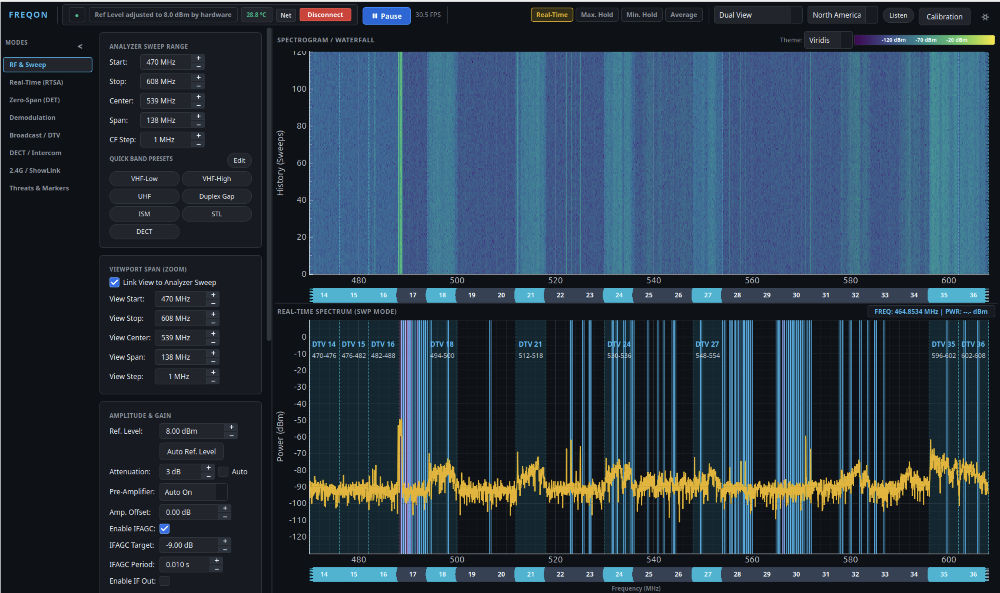
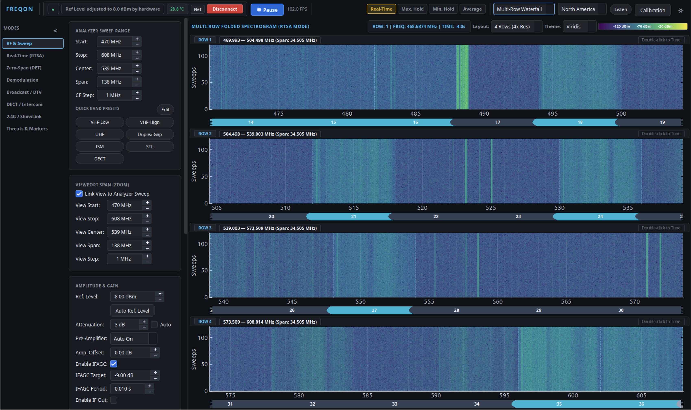
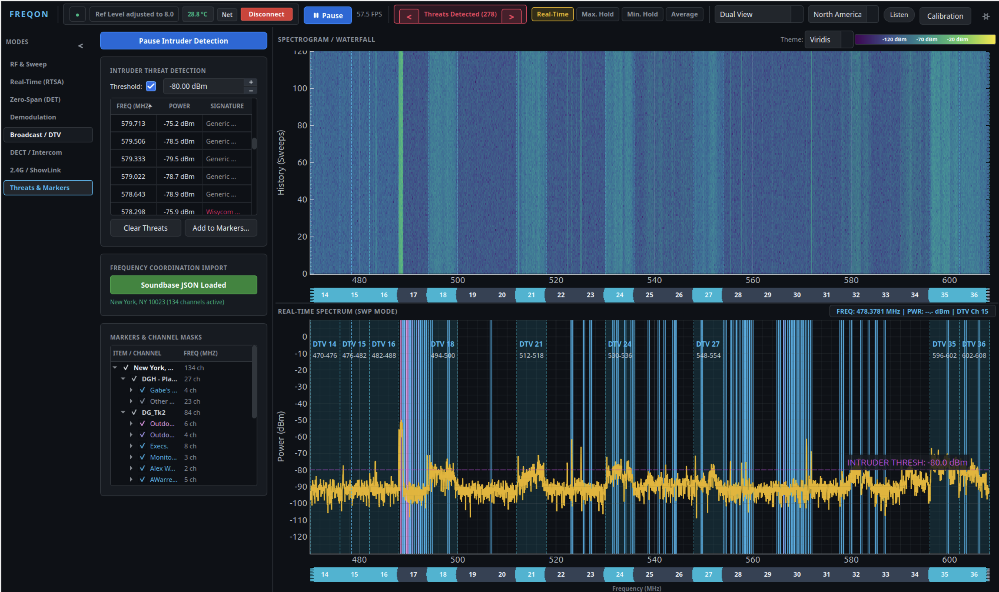

# fReqon - RF Analysis Tool for Harogic Analyzers

**fReqon** is a high-performance RF Spectrum Analysis, Signal Intelligence, and Live Frequency Monitoring suite built specifically for **Harogic Technologies** Real-Time Spectrum Analyzers (SAN, SAM, SAE series). Designed for wireless audio coordination, broadcast engineering, and live-event RF defense, fReqon delivers real-time DPX acquisition, deep hardware control, continuous sweeping, multi-row folded spectrograms, and automated rogue transmission detection.

---

## Visual Tour

### 1. Dual View (Spectrogram / Real-Time Spectrum)

*Figure 1: Main dual-viewport interface featuring a synchronized spectrogram waterfall and real-time spectrum trace across the UHF band, complete with ATSC DTV channel blocks, active Soundbase carrier masks, and full hardware sweep controls.*

---

### 2. Multi-Row Folded Spectrogram

*Figure 2: 4-Row Folded Spectrogram view segmenting the UHF span across stacked rows. This layout multiplies horizontal resolution fourfold, ensuring narrowband microphone carriers and brief transient bursts remain sharp and distinctly visible without horizontal compression.*

---

### 3. Threat Detection & Intruder Alert

*Figure 3: Threat Detection & Markers mode actively monitoring the UHF band with loaded Soundbase channel allocations, broadcast television masks, an active -80.0 dBm threshold line, and real-time identified rogue carriers cataloged in the threats table.*

---

## Threat Detection & Intruder Alert

fReqon's **Threat Detection & Intruder Alert** system provides automated, real-time protection against uncoordinated and unauthorized RF carriers during live productions:

- **Approved Carrier Masking via Soundbase**: Import a Soundbase frequency coordination file (`.sbcoordsite` / JSON) to load your authorized production frequencies. fReqon automatically creates protective channel masks around all approved transmitters.
- **Broadcast DTV Masking**: Overlay North American (ATSC 6 MHz) or European (OFCOM 8 MHz) television allocations to account for known licensed broadcast stations.
- **Dynamic Threshold Evaluation**: An interactive threshold line on the spectrum display defines the trip level. Any live RF peak exceeding this threshold that is **not** inside an approved Soundbase mask or active DTV mask is immediately flagged as a potential threat.
- **Spectral Signature Analysis**: For every flagged threat, the engine analyzes the signal’s occupied bandwidth, shape, and modulation characteristics to identify candidate transmitter types (e.g., Shure Axient Digital, Wisycom, Sennheiser, analog FM, or generic carriers).
- **Rapid Navigation & Mitigation**: Operators can click any entry in the live Threats Table to snap tracking crosshairs and HUD readouts directly onto the rogue carrier, cycle through active alerts via top-bar steppers, or convert threats into permanent avoidance markers with one click.

---

## Core Capabilities

- **Real-Time Spectrum Analysis (RTSA)**: High-speed hardware DPX acquisition streaming dense persistence sweeps at over 150 FPS.
- **Multi-Row Folded Waterfall**: Splits wideband spans across 2, 3, 4, or 8 rows to preserve critical horizontal pixel density for narrowband wireless channels.
- **Audio Demodulation Engine**: High-fidelity live demodulation for AM, FM, WFM, LSB, and USB signals with bandpass filtering and low-latency audio playback.
- **Zero-Span Time Domain (DET)**: High-speed oscilloscope-style burst and pulse repetition analysis.
- **Digital Intercom & Protocol Analyzers**:
  - **DECT Analysis**: Timeslot occupancy matrices and channel activity for DECT 6.0 and European wireless intercoms (Riedel Bolero, Clear-Com FreeSpeak).
  - **ShowLink & CRMX**: Continuous 2.4 GHz monitoring for Shure ShowLink access points and LumenRadio wireless DMX fixtures.
- **Multi-Device Orchestration**: Manage multiple Harogic analyzers across Single, Diversity, and Split-Sweep topologies over USB or Gigabit Ethernet.

---

## Project Structure

```
├── RF_Recon_Modern/          # Modern modular application architecture
│   ├── main.py               # Main application entry point
│   ├── core/                 # DSP engines, Harogic C-API wrapper, and analyzers
│   │   ├── device_controller.py      # Hardware subprocess worker and queue reader
│   │   ├── multi_device_manager.py   # Multi-device orchestration and topologies
│   │   ├── demod_engine.py           # AM/FM/SSB audio DSP demodulator
│   │   ├── transmitter_classifier.py # RF signal signature recognition engine
│   │   ├── dect_analyzer.py          # DECT / Bolero timeslot analyzer
│   │   ├── showlink_crmx_analyzer.py # 2.4 GHz wireless stage equipment analyzer
│   │   └── fcc_database.py           # FCC & OFCOM digital TV lookup engines
│   └── ui/                   # PySide6 / PyQt6 widgets, dialogs, and themes
│       ├── main_window.py            # Primary application window & hub
│       ├── theme.py                  # Obsidian dark industrial styling
│       └── widgets/                  # Viewports, waterfall, and control panels
├── RF_Recon_App/             # Legacy monolithic application archive
├── API/                      # Harogic Linux API, SDK drivers, and examples
├── CalFile/                  # Hardware calibration tables
└── docs/                     # Documentation assets and screenshots
    └── images/               # Visual Tour figures and documentation captures
```

---

## Getting Started

### Prerequisites
- **Linux** (Ubuntu 20.04+, Debian 11+, or compatible kernel)
- **Python 3.10+**
- Harogic Analyzer driver library (`libhtraapi.so`) installed in `/opt/htraapi/lib/` or system library path.

### Installation
1. Clone the repository:
   ```bash
   git clone https://github.com/mbsound/fReqon---RF-Analysis-Tool-for-Harogic-Analyzers.git
   cd fReqon---RF-Analysis-Tool-for-Harogic-Analyzers
   ```
2. Install Python dependencies:
   ```bash
   pip install -r RF_Recon_App/requirements.txt
   ```
3. Set up Harogic Linux API:
   Follow the setup script in `API/Linux_API-SAN-828/Linux_API/install_htraapi_lib.sh` or ensure `libhtraapi.so` is linked.

### Launching fReqon
Launch the modern suite:
```bash
python3 RF_Recon_Modern/main.py
```
