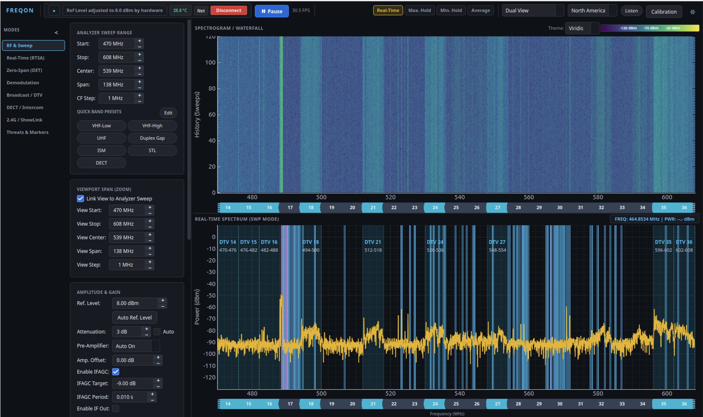
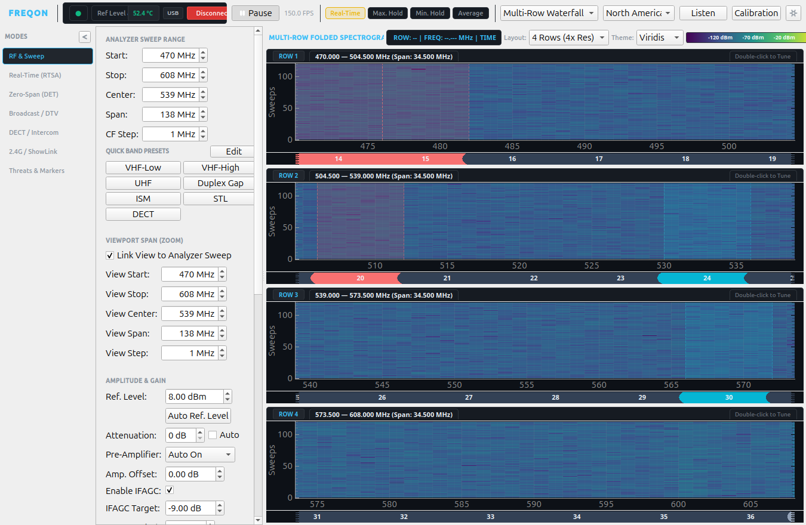
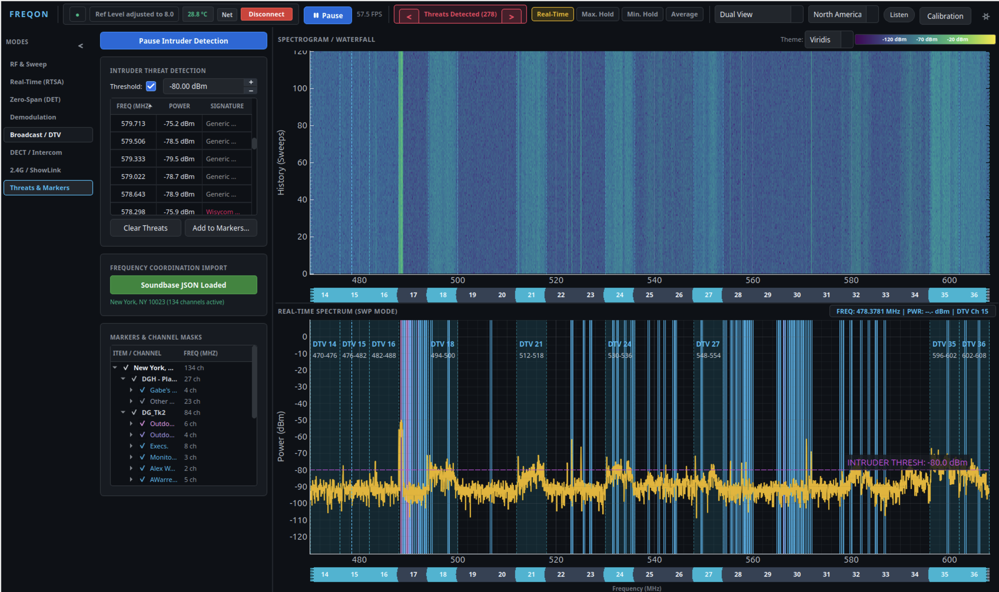
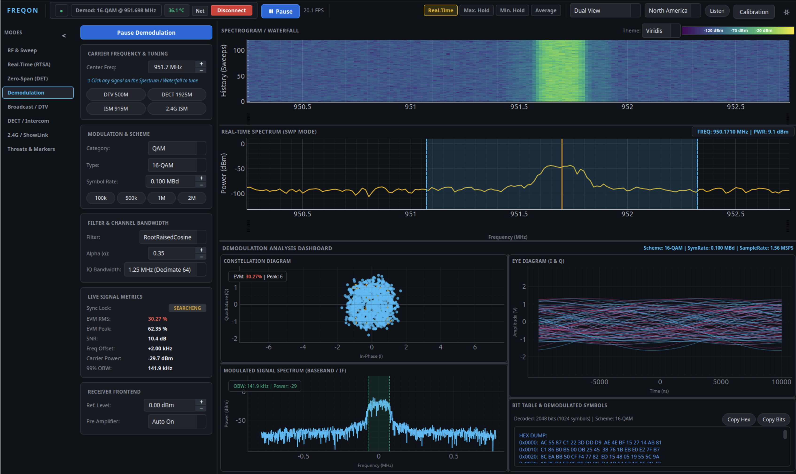

# fReqon - RF Analysis Tool for Harogic Analyzers

[](https://creativecommons.org/licenses/by-nc/4.0/)

**fReqon** is a high-performance RF Spectrum Analysis, Signal Intelligence, and Live Frequency Monitoring suite built specifically for **Harogic Technologies** Real-Time Spectrum Analyzers (SAN, SAM, SAE series). Designed for wireless audio coordination, broadcast engineering, and live-event RF defense, fReqon delivers real-time DPX acquisition, deep hardware control, continuous sweeping, multi-row folded spectrograms, and automated rogue transmission detection.

---

## Visual Tour

### 1. Dual View (Spectrogram / Real-Time Spectrum)

*Figure 1: Main dual-viewport interface featuring a synchronized spectrogram waterfall and real-time spectrum trace across the UHF band, complete with ATSC DTV channel blocks, active Soundbase carrier masks, and full hardware sweep controls.*

---

### 2. Multi-Row Folded Spectrogram

*Figure 2: 4-Row Folded Spectrogram view segmenting the UHF span across stacked rows. This layout multiplies horizontal resolution fourfold, ensuring narrowband microphone carriers and brief transient bursts remain sharp and distinctly visible without horizontal compression.*

---

### 3. Threat Detection & Intruder Alert

*Figure 3: Threat Detection & Markers mode actively monitoring the UHF band with loaded Soundbase channel allocations, broadcast television masks, an active -80.0 dBm threshold line, and real-time identified rogue carriers cataloged in the threats table.*

---

### 4. Demodulation Analysis Dashboard

*Figure 4: Real-time Demodulation Analysis Dashboard performing baseband I/Q demodulation (16-QAM shown). Features synchronized Constellation and Eye diagrams, demodulated IF spectrum with 99% OBW/power metrics, real-time EVM/SNR measurements, and decoded symbol/hex bitstream display.*

---

## Threat Detection & Intruder Alert

fReqon's **Threat Detection & Intruder Alert** system provides automated, real-time protection against uncoordinated and unauthorized RF carriers during live productions:

- **Approved Carrier Masking via Soundbase & Wireless Workbench**: Import frequency coordination files from **Soundbase** (`.sbcoordsite` / JSON) or **Shure Wireless Workbench** (`.csv`) to automatically load authorized production frequencies, channel names, equipment profiles, and custom colors. fReqon automatically generates protective channel masks around all approved transmitters and integrates user exclusions.
- **Broadcast DTV & Radio Astronomy Masking**: Overlay North American (ATSC 6 MHz) or European (OFCOM 8 MHz) television allocations, alongside a mandatory Channel 37 (608–614 MHz) radio astronomy and medical telemetry protection mask.
- **Dynamic Threshold Evaluation**: An interactive threshold line on the spectrum display defines the trip level. Any live RF peak exceeding this threshold that is **not** inside an approved coordination mask or active DTV mask is immediately flagged as a potential threat.
- **Spectral Signature Analysis**: For every flagged threat, the engine analyzes the signal’s occupied bandwidth, shape, and modulation characteristics to identify candidate transmitter types (e.g., Shure Axient Digital, Wisycom, Sennheiser, analog FM, or generic carriers).
- **Rapid Navigation & Mitigation**: Operators can click any entry in the live Threats Table to snap tracking crosshairs and HUD readouts directly onto the rogue carrier, cycle through active alerts via top-bar steppers, or convert threats into permanent avoidance markers with one click.

---

What is not an intruder: anything inside a TV or public-safety channel mask that
is on, inside a coordinated carrier's mask (Soundbase / Workbench), or inside a
carrier you have added to the markers from the alerts (while it is ticked).
Wide blocks are named from the transmitter lookup when a station is licensed on
that channel, and narrow or briefly keyed carriers in the T-Band (TV channels
14–20) are labelled land mobile radio — as an assumption until a lookup for your
location confirms what is licensed there.

## Rapid Channel Monitor (Hardware MSCAN Mode)

Rather than continuously sweeping across hundreds of megahertz to check individual carriers, the **Rapid Channel Monitor** leverages Harogic's hardware-accelerated discrete channel scanning mode (**MSCAN**):

- **High-Speed Discrete Channel Hopping**: The hardware analyzer rapidly steps through a discrete list of user-assigned carrier frequencies, measuring true peak and average RSSI levels across dozens or hundreds of frequencies in milliseconds.
- **Responsive 5-Column Grid**: Each coordinated wireless channel is rendered as an interactive card displaying channel name, operating frequency, real-time signal strength meter (dBm RSSI), and peak power indicators.
- **Coordination Color Integration**: Channel cards and tree items adopt the custom color tags defined in your Soundbase or Shure Wireless Workbench coordination plans for immediate visual identification.
- **Selectable IF Filter Bandwidths**: Choose from 100 kHz, 200 kHz, 400 kHz, or 800 kHz IF channel filter bandwidths with hardware decimation factors (up to Decimate 256) to cleanly isolate tightly spaced carriers in high-density RF environments.
- **Clean Engine Transitions**: Seamless hardware state transitions allow instant switching between Rapid Channel Monitoring, Swept-Spectrum (SWP), and RTSA without driver desynchronization.

---

## Demodulation Analysis Engine

fReqon includes a comprehensive Digital and Analog Demodulation suite, enabling deep signal inspection, modulation verification, and audio monitoring:

- **Digital I/Q Demodulation Schemes**: Hardware I/Q streaming demodulation supporting **QAM** (16-QAM, 64-QAM, 256-QAM), **PSK** (BPSK, QPSK, 8-PSK), **FSK/GFSK**, and **ASK**.
- **Interactive Tuning & Matched Filters**: Click any carrier directly on the spectrum or waterfall to tune instantly. Select symbol rates (from 100 kBd to multi-MBd), configure Root-Raised Cosine (RRC) matched filter alpha roll-offs, and set channel decimation bandwidths.
- **Deep Signal Quality Metrics**: Live dashboard displaying **Sync Lock**, **EVM RMS / Peak (%)**, **SNR (dB)**, **Carrier Frequency Offset (kHz)**, **Received Carrier Power (dBm)**, and **99% Occupied Bandwidth (OBW)**.
- **Visual Signal Diagnostics**:
  - **Constellation Diagram**: Real-time I/Q scatter plot visualizing symbol clustering and phase noise against ideal target points.
  - **Eye Diagram (I & Q)**: Synchronized time-domain multi-trace overlay highlighting symbol transition jitter, timing margins, and eye openings.
  - **Baseband / IF Spectrum**: Centered FFT showing passband flatness, filter boundaries, and spectral leakage.
  - **Bitstream & Hex Inspector**: Real-time symbol decoder extracting raw bit tables and formatted hex dumps with instant copy-to-clipboard functionality.
- **Analog Audio Demodulation**: Listen directly to broadcast FM, communications AM, wideband broadcast (WFM), and single-sideband (LSB/USB) transmissions with real-time bandpass filtering and low-latency audio output.

---

## Core Capabilities

- **Real-Time Spectrum Analysis (RTSA)**: High-speed hardware DPX acquisition streaming dense persistence sweeps at over 150 FPS.
- **Rapid Discrete Channel Monitoring (MSCAN)**: Hardware discrete frequency polling across Soundbase and Wireless Workbench carrier lists.
- **Multi-Row Folded Waterfall**: Splits wideband spans across 2, 3, 4, or 8 rows to preserve critical horizontal pixel density for narrowband wireless channels.
- **Coordination Importers**: Native support for **Shure Wireless Workbench** (`.csv`) and **Soundbase** (`.sbcoordsite` / JSON) with auto-generated masks and custom colors.
- **Regulatory & Astronomy Protection**: Automated DTV station overlays and mandatory Channel 37 (608–614 MHz) radio astronomy exclusion zones.
- **Audio Demodulation Engine**: High-fidelity live demodulation for AM, FM, WFM, LSB, and USB signals with bandpass filtering and low-latency audio playback.
- **Zero-Span Time Domain (DET)**: High-speed oscilloscope-style burst and pulse repetition analysis.
- **Digital Intercom & Protocol Analyzers**:
  - **DECT Analysis**: Timeslot occupancy matrices and channel activity for DECT 6.0 and European wireless intercoms (Riedel Bolero, Clear-Com FreeSpeak).
  - **ShowLink & CRMX**: Continuous 2.4 GHz monitoring for Shure ShowLink access points and LumenRadio wireless DMX fixtures.
- **Multi-Device Orchestration**: Manage multiple Harogic analyzers across Single, Diversity, and Split-Sweep topologies over USB or Gigabit Ethernet.

---

## Project Structure

```
├── RF_Recon_Modern/          # Modern modular application architecture
│   ├── main.py               # Main application entry point
│   ├── core/                 # DSP engines, Harogic C-API wrapper, and analyzers
│   │   ├── device_controller.py      # Hardware subprocess worker (SWP, RTSA, MSCAN, DET)
│   │   ├── multi_device_manager.py   # Multi-device orchestration and topologies
│   │   ├── demod_engine.py           # AM/FM/SSB audio DSP demodulator
│   │   ├── transmitter_classifier.py # RF signal signature recognition engine
│   │   ├── soundbase_parser.py       # Soundbase JSON coordination parser
│   │   ├── wwb_parser.py             # Shure Wireless Workbench (.csv) coordination parser
│   │   ├── dect_analyzer.py          # DECT / Bolero timeslot analyzer
│   │   ├── showlink_crmx_analyzer.py # 2.4 GHz wireless stage equipment analyzer
│   │   └── fcc_database.py           # FCC & OFCOM digital TV lookup engines
│   └── ui/                   # PySide6 / PyQt6 widgets, dialogs, and themes
│       ├── main_window.py            # Primary application window & navigation hub
│       ├── theme.py                  # Obsidian dark industrial styling
│       └── widgets/                  # Viewports, waterfall, and control panels
│           ├── mscan_view.py         # Rapid Channel Monitor 5-column grid view
│           ├── spectrum_view.py      # Real-time spectrum plot with interactive markers
│           ├── waterfall_view.py     # High-speed spectrogram view
│           ├── multi_row_waterfall.py# Folded high-resolution waterfall
│           └── panels/               # Sliding dock panels (MSCAN, Threats, RTSA, etc.)
└── docs/                     # Documentation assets and screenshots
    └── images/               # Visual Tour figures and documentation captures
```

---

## Getting Started

### Prerequisites
- **Linux** (Ubuntu 20.04+, Debian 11+, or compatible kernel) or **macOS on Apple silicon**
- **Python 3.10+**
- The Harogic SDK library for Harogic analyzers:
  - Linux: `libhtraapi.so` installed in `/opt/htraapi/lib/` (Harogic's `Linux_API` download).
  - macOS: `libhtraapi*.dylib` in `RF_Recon_Modern/lib/macos/`, from
    [Harogic-Mac-SDK](https://github.com/mbsound/Harogic-Mac-SDK) (step 3 below). Analyzer
    firmware and SDK builds must match, so fReqon can hold several builds there
    (`libhtraapi-0.55.89.dylib`, `libhtraapi-0.55.100.dylib`, ...) and uses whichever each
    analyzer accepts.
  - A tinySA needs no SDK: without the library fReqon still starts and drives a tinySA.

### Installation
1. Clone the repository:
   ```bash
   git clone https://github.com/mbsound/fReqon---RF-Analysis-Tool-for-Harogic-Analyzers.git
   cd fReqon---RF-Analysis-Tool-for-Harogic-Analyzers
   ```
2. Install Python dependencies:
   ```bash
   pip install -r RF_Recon_Modern/requirements.txt
   ```
3. Set up the Harogic SDK.
   - Linux: download `Linux_API` from Harogic, run its `install_htraapi_lib.sh`, or
     otherwise make sure `libhtraapi.so` is on the library path.
   - macOS: download the zips from the
     [Harogic-Mac-SDK releases](https://github.com/mbsound/Harogic-Mac-SDK/releases) (one per
     firmware generation), remove the download quarantine, and copy each `lib/` folder's
     contents into `RF_Recon_Modern/lib/macos/`, naming each `libhtraapi.dylib` after its SDK
     version:
     ```bash
     mkdir -p RF_Recon_Modern/lib/macos
     for v in 0.55.89 0.55.100; do
       unzip -q Harogic-Mac-SDK-*-arm64-sdk$v.zip
       xattr -dr com.apple.quarantine Harogic-Mac-SDK-*-arm64-sdk$v
       cp Harogic-Mac-SDK-*-arm64-sdk$v/lib/libhtraapi.dylib RF_Recon_Modern/lib/macos/libhtraapi-$v.dylib
       cp -n Harogic-Mac-SDK-*-arm64-sdk$v/lib/{libstdc++.6.dylib,libgcc_s.1.1.dylib,libusb-1.0.0.dylib,htrausb.conf} RF_Recon_Modern/lib/macos/
     done
     cp RF_Recon_Modern/lib/macos/libhtraapi-0.55.100.dylib RF_Recon_Modern/lib/macos/libhtraapi.dylib
     ```

### Launching fReqon
Launch the modern suite:
```bash
python3 RF_Recon_Modern/main.py
```

---

## Calibration

Calibration files are specific to each analyzer, so fReqon does not ship any.
When an analyzer connects, fReqon reads its model and serial number from the
device and the analyzer supplies its own RF/IF calibration, which fReqon stores in
its calibration library (`~/.config/Freqon/calibrations`). If an analyzer can't
supply calibration, fReqon asks you to import its files (e.g. from the USB stick
or download that came with it) in the Calibration Manager, which is also where
optional extras such as amplitude-compensation (`ampcomp`) files go.

### Input chains (antenna, cable, amplifier)

**Calibration ▾ → Input Chains** in the top bar describes what sits between
the air and each analyzer: antenna gain, coax loss (quoted at one frequency and scaled with √f,
like real coax), inline or antenna-mounted amplifiers, attenuators, splitters,
and measured responses imported as CSV (frequency, dB) or Harogic `*_ampcomp.txt`
files. fReqon adds the losses and removes the gains, so levels read as they would
at the antenna's output. If you include the antenna's gain, levels are referred
to a 0 dBi antenna instead. Each analyzer gets its own chain.
The correction is applied in the analyzer SDK, so sweeps and MSCAN include it,
and it is re-applied on every connect. When a chain is active, the
**Calibration** button shows a dot and is highlighted, and its tooltip shows the
correction at 470, 550 and 608 MHz.

---

## Using two analyzers

Any mix works: two USB, two network, or one of each. Give each slot its own
analyzer in the Connection dialog. For USB the dialog looks for analyzers when
it opens (and on **Rescan**) and each slot picks from what was found: Harogic
analyzers by model and serial number, tinySAs by model and serial port, with
any that a slot already holds marked as connected. A choice is pinned (a Harogic
analyzer by its serial number, a tinySA by its port), so it survives replugging
in another order; *Automatic* instead takes the analyzers in the order found,
Harogic first. Network analyzers are given by IP address. fReqon refuses a USB
analyzer that isn't there rather than quietly opening another one, and if two
slots turn out to be the same analyzer it keeps it on the primary slot and
tells you. The scan works the same on macOS and Linux; on Linux a tinySA's
serial port needs your user in the `dialout` group, and the dialog says so if
that is what stops it. Topologies: split sweep (each analyzer covers half the span, stitched
into one trace), diversity (both on the full span: A, B and A−B traces), and
independent (each feeds its own detectors).

### Settings per analyzer

With two or more analyzers connected, **Analyzer Settings For** at the top of
the RF & Sweep panel chooses whose settings the panel shows: RF input,
amplitude and gain, bandwidth, and sweep and detector settings are kept per
analyzer, and a change goes only to the analyzer shown. The panel shows just
the settings that analyzer has, so a tinySA beside a Harogic analyzer each get
their own. Analyzers of the same model can also be set together (*All
analyzers*). Choosing an analyzer only shows its settings; nothing is sent
until you change something. An analyzer that drops out and reconnects gets its
settings back.

## tinySA and tinySA Ultra

fReqon also drives the tinySA and tinySA Ultra (including the Ultra+ ZS406/ZS407)
over their USB serial port. Plug one in and connect as usual: with no Harogic
analyzer on USB the primary slot finds the tinySA by itself, and beside a
Harogic analyzer you pick it for a slot in the Connection dialog. No calibration files are involved (a tinySA is calibrated
internally), and input chains work as they do for any analyzer.

A tinySA is a swept analyzer without an IQ output, so with one connected fReqon
greys out the modes it cannot do, and the RF & Sweep panel shows only the
settings it has:

| | tinySA | tinySA Ultra |
|---|---|---|
| Swept spectrum, waterfall, threats, intermod, DTV | yes | yes |
| Rapid Channel Monitor | yes, stepped (see below) | yes, stepped |
| Frequency range | 100 kHz – 960 MHz | 100 kHz – 5.3 GHz (ZS407: 7.3 GHz) |
| DECT, 2.4 GHz / ShowLink | no (out of range) | yes |
| Zero-Span | yes, about 17 600 samples a second (see below) | yes |
| Real-Time (RTSA), Demodulation, Listen | no | no |
| RBW | 3, 10, 30, 100, 300, 600 kHz | 0.2, 1, 3, 10, 30, 100, 300, 600, 850 kHz |
| Attenuation | Low input: 0–31 dB or auto. High input: a 25–40 dB pad, in or out | 0–31 dB or auto |
| Pre-amplifier | no | LNA on/off |
| Spur rejection | off / on (low input) | off / auto / on |
| VBW, IF AGC, IF out, sweep time, window, detectors | no | no |

- **RBW**: *Auto* picks the finest bandwidth that sweeps the span in 1500 points
  or fewer (300 kHz for 470–608 MHz). A manual value uses the nearest bandwidth
  the analyzer has. Narrow bandwidths over wide spans are slow: that is the
  hardware.
- **Rapid Channel Monitor**: there is no hardware channel scan, so each channel
  gets a short sweep across its bandwidth in turn. This is far slower than a
  Harogic MSCAN (about 4 channels a second on a tinySA with firmware v1.3),
  and the dwell and detector settings do not apply.
- **tinySA (basic) inputs**: the Low input covers up to 350 MHz and the High
  input 240–960 MHz. They are separate connectors, so the signal has to be on
  the one in use. **RF Input** in the sweep panel chooses it, and the line
  under it (and a notice in the top bar when it changes) says which is in use:
  - *Auto (by frequency)*: Low for a sweep that ends at or below 350 MHz, High
    for one that starts at or above 240 MHz, and both for a sweep across
    350 MHz (Low below it, High above: both connectors must be fed).
  - *Low* or *High*: only that connector. The sweep is limited to what it
    tunes; a range it cannot reach at all is not swept, and the panel says why.

  UHF wireless microphone bands use the High input, which has less filtering
  than the Low input.
- **tinySA (basic) attenuation**: only the Low input has the 0–31 dB step
  attenuator. The High input has a single pad (25–40 dB depending on
  frequency, about 23 dB at 500 MHz) that is in or out, and readings are
  corrected for it. The Attenuation control follows the input in use: a dB
  value (or Auto) on the Low input, an *Attenuator in* switch on the High
  input, and for a sweep over both, the dB value with the pad in whenever it
  is above 0 dB. It is one setting: switching the pad in from 0 dB sets 10 dB.
- **Zero-Span**: the analyzer samples one frequency over time (a scan whose
  start and stop are the same). The rate is fixed, about 57 µs a sample
  (measured on each analyzer when zero span is first used), so a capture is
  0.03 s (512 samples) to 0.9 s (15 936), with a pause of 0.2–0.3 s between
  captures. That resolves keying, bursts and frames of a millisecond and up
  (land mobile radio traffic, a transmitter switching on), not DECT or
  Bluetooth slots. The detection bandwidth is the RBW set in RF & Sweep
  (Auto: the widest, 600 kHz). Amplitude & Gain in the zero-span panel offers
  what the analyzer has at the centre frequency: on a tinySA, 0–31 dB or Auto
  on the Low input and the pad in or out on the High input, with no
  pre-amplifier; on a tinySA Ultra, 0–31 dB or Auto and the LNA. It starts
  from the sweep's settings each time zero span is opened and applies to
  zero span only. There is no external trigger. Trigger sources:
  - *Free run*: captures one after another.
  - *Level, in each capture*: the same, with the window starting just before
    the first rise through the trigger level. An event in the pause between
    captures is missed.
  - *Level, armed*: the tinySA's own triggered sweep. It waits for the level
    for as long as it takes and puts the crossing in the middle of the window,
    so what led up to it is shown too. The window is the chosen length, but
    only 290 points across it (0.1 ms a point for 29 ms, 3 ms a point for
    0.9 s). fReqon looks for a capture every window + 0.4 s, and each look
    blinds the trigger for about 0.1 s. Use it for events that are rare or
    short; use the other two for detail.
- **tinySA Ultra**: fReqon turns on the Ultra mode when a sweep goes above
  800 MHz (900 MHz on the Ultra+). The LNA bypasses the attenuator.
- The analyzer's own screen is paused while fReqon drives it and resumes on
  disconnect.

`FREQON_TINYSA_PORT=/dev/…` names the serial port(s) to use instead of looking
for the tinySA's USB IDs. `testing/tinysa_sim.py` is a simulated tinySA for
trying this without the hardware, and `testing/test_tinysa.py` tests the driver
against it.

## Broadcast / DTV: which TV channels to avoid

**Lookup** lists the transmitters near a ZIP or postcode and masks the channels
that are blocked where you are, judged from the licences alone:

- a **full-power** station is masked when its power and distance predict a
  strong signal (about 60 dBµV/m or more: a megawatt 25 miles away is masked,
  the same station 55 miles away is not);
- a **low-power** station (15 kW or less at UHF, 3 kW at VHF, whatever its
  licence class) is masked only when it is practically next door, because such
  stations deliver far less than their ERP suggests;
- stations that are not licensed yet (applications, construction permits) are
  never masked, and land mobile radio channels always are.

Everything else is listed unticked. The tick beside each row shows or hides
that channel's mask, **All On** / **All Off** does every listed channel, and
clicking a channel in the bar under the spectrum toggles it too.

**Scan T-Band** watches TV channels 14–20 (470–512 MHz, shared with land mobile
radio in US metro areas) and works out what each carries: a signal filling the
channel is a TV station; narrow carriers that key on and off are land mobile
radio, and that channel is masked red while it is heard and for a minute after.

| Mask | Meaning |
|---|---|
| Blue | A TV channel, with the station on the mask: call sign, city, ERP and distance (the strongest of several on one channel, "+1" for the others) |
| Red | Land mobile radio: T-Band public-safety channels near the cities that have them, and the LMR/SMR allocations |
| Grey | Channel 37 in the US (radio astronomy and medical telemetry): off limits, shown from the start, never cleared by detection |

**Auto DTV Detect** then says which of those channels are actually on the air
where you are, and finds occupied channels the lookup does not list. It
recognises a TV signal by its shape, a flat block filling the channel above
the noise floor, so it needs no threshold: the floor is taken from the sweep
itself, at whatever RBW, gain or antenna you are using, and wireless
microphones in a channel are not mistaken for a station. A clear signal shows
on the first sweep; one within a few dB of the margin (6 dB above the floor by
default) takes a few sweeps of averaging. The table's *Live* column shows how
far above the floor each station is, or *clear*. A mask you set by hand while
detection runs stays as you set it.

Automatic detection needs a sweep at least three channels wide, and judges
only channels wholly inside it. If every channel in the sweep is occupied
there is no floor to find: sweep wider, or switch *Detection* to *Fixed
threshold*, which applies the same shape test against a level you set (with
the draggable line on the spectrum). `core/dtv_detect.py` has the detector and
`testing/test_dtv.py` its tests.

## Locate: where is that carrier? (sensor network)

With three or more analyzers around a venue, the **Locate** mode estimates
where each carrier is and what it is. Choose the *Sensor Network* topology in
the Connection dialog (add as many analyzers as you have; any mix of USB and
network), give every sensor a position in the Locate panel — its own GNSS fix
outdoors, or latitude/longitude or east/north metres from a venue drawing —
and sweep. Every sensor's levels for a carrier go into a power multilateration
(a log-distance model with the transmitter power as an unknown; the path-loss
exponent is adjustable: ~2.5 open air, 3–3.5 inside), giving a position with
an uncertainty ellipse on the map; the fingerprints from all sensors are
combined into one device guess. Expect tens of metres outdoors and a zone
indoors: received power is a coarse ranging method, and multipath is what
limits it. Two sensors only give a point between them.

A TDOA refinement (synchronised, GNSS-timestamped IQ captures on every sensor,
cross-correlated and solved hyperbolically; `core/geolocate.py` has the solver
and correlator) is the next phase; it needs a GNSS fix and a disciplined clock
on every sensor, which the analyzers' GNSS modules provide outdoors.

## Network & Remote Analyzers

fReqon natively supports Harogic Ethernet network analyzers (e.g., Raspberry Pi Compute Module 5 based Model 67/828) across local subnets:
- **Subnet Auto-Discovery**: The Connection Dialog probes the local subnets for Harogic devices on ports 5000/9000, so no manual IP entry is needed. The scan finds addresses only; each analyzer's model and serial number are read from the device when it connects.
- **Hardware & Firmware Setup Guide**: For embedded analyzer provisioning, bootloader power rail configurations, and daemon stability patches, see the [Harogic Network Analyzer Setup & Fix Guide](docs/hardware/harogic_network_analyzer_fix.md).
- **Automated Provisioning Tool**: Use [`tools/remote_analyzer/provision_harogic_network_server.py`](tools/remote_analyzer/provision_harogic_network_server.py) to diagnose and configure remote analyzers over SSH.

---

## License

This project is licensed under the **[Creative Commons Attribution-NonCommercial 4.0 International License (CC BY-NC 4.0)](LICENSE)**.

- **Attribution Required**: You must give appropriate credit to `mbsound`, provide a link to the license, and indicate if changes were made.
- **Non-Commercial Only**: You may freely adapt, copy, and share this software for non-commercial purposes. **Commercial use, selling, or distributing for monetary compensation is strictly prohibited.**
- For the full legal code, see the [LICENSE](LICENSE) file.

## Data sources

- UK television transmitter data: Ofcom, "Television transmitter frequency data". Contains public
  sector information licensed under the Open Government Licence v3.0. fReqon ships with Ofcom's
  file of 8 October 2024 (`RF_Recon_Modern/ofcom_tv.db`, rebuilt with `tools/build_ofcom_db.py`);
  a newer spreadsheet can be imported in Broadcast / DTV > Update UK Data (UK region).
- Spain: Plan Técnico Nacional de la Televisión Digital Terrestre, Real Decreto 391/2019
  (BOE-A-2019-9513, consolidated text). Channels per geographic area; Spain publishes no
  transmitter list. `RF_Recon_Modern/data/spain_tdt_plan.json`.
- Portugal: DTT transmitter list (ANACOM / network operator), as published at
  electronica-pt.com/mapa-emissores.php. `RF_Recon_Modern/data/portugal_tdt.json`.
  Both rebuilt with `tools/build_iberia_tv.py`.
